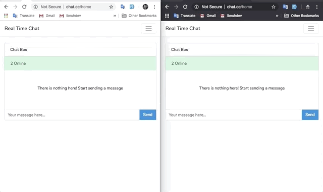

# Laravel Realtime Chat

Just to get rid of my boredom. Build with Vue and Pusher

## Preview



## Installation

```
Clone the repository
```

```
composer install && npm install
```

Update your `.env` file

```
DB_CONNECTION=sqlite
DB_DATABASE=/Users/disappear/work/chat/database/db.sqlite
BROADCAST_DRIVER=pusher
PUSHER_APP_ID=REDACTED
PUSHER_APP_KEY=REDACTED
PUSHER_APP_SECRET=REDACTED
PUSHER_APP_CLUSTER=REDACTED
```

```
npm run (dev | prod)
```

## License

MIT
